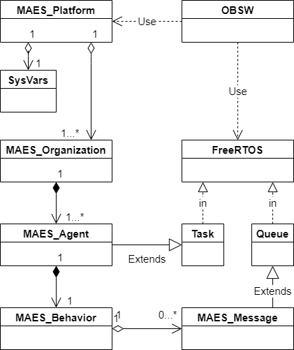

# Modelo de clases para FreeMAES

## Diagrama del modelo 

Mediante las clases y relaciones mostradas en el diagrama, se puede notar que:

* Los agentes corresponden a contenedores de tareas mediante su comportamiento, que a su vez pueden incluir un sistema de mensajería que encapsula una cola dedicada por agente
* Los agentes pueden asociarse por organizaciones designadas como equipos o jerarquías que pertenecen a una única plataforma de software conteida en el equipo electrónico. 
* La clase `sysVars` funciona como un arreglo de variables de entorno que soporta otras funciones del paradigma.

