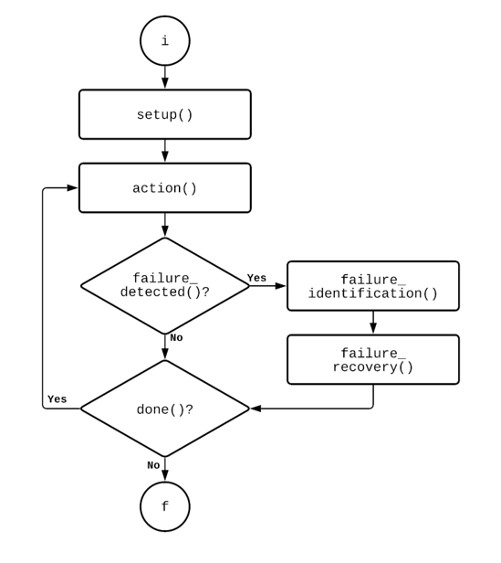

# Comportamientos

## Diagrama del funcionamiento de `execute`

Los comportamientos encapsulan las funciones de FreeRTOS que crean las tareas y buzones para los agentes. En este API se incluyen tres comportamientos con métodos virtuales: una clase genérica y dos subclases derivadas

* comportamiento cíclico
* comportamiento _One Shot_ (una sola ejecución)

La principal diferencia entre las clases derivadas corresponde al método done, pues para el comportamiento cíclico siempre es verdadero y para el _One Shot_ es falso.

El método `execute` asocia los métodos de cada clase y subclase como se muestra en el diagrama. Dicho método debe encerrarse con una función _wrapper_ para ser asignado como la función de tarea de un agente
